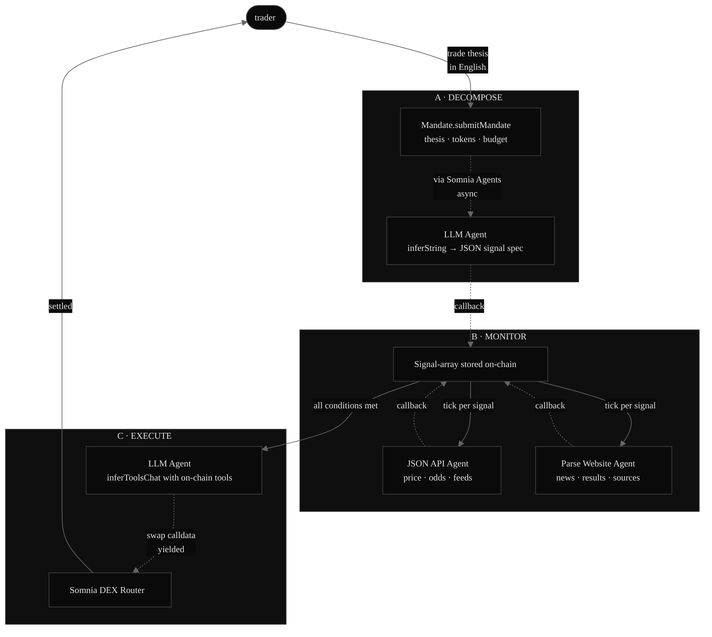

# LICTOR

**State a thesis. Agents execute.**

Plain-English autonomous trading on Somnia's Agentic L1.

Tell Lictor what you want to do — *"Short ETH if Polymarket recession odds break 60% and ETH drops below $2,500"* — and a chain of on-chain agents decomposes the thesis, monitors the signals, and executes the trade when conditions fire. No human in the loop after the mandate is set. Every AI step reaches validator consensus and produces a receipt.

---

## Why this only works on Somnia

Quantitative trading today is built from three disconnected layers: signals (off-chain APIs), decisions (off-chain Python or cloud bots), and execution (exchange APIs or DEX routers). The "trustless contract" is leashed to a trusted middleman at every step.

Other chains that push the "agentic" narrative still run inference off-chain with attestations. The AI step is a trusted black box.

Somnia is different. Validators run the LLM directly with `temperature=0` and fixed seeds, so every node reaches consensus on the *exact bytes* the model produces. The decision step lives in the consensus layer. Combined with `inferToolsChat`, which lets the model yield ABI-encoded calldata back to the calling contract, the entire trading pipeline — read, classify, decide, execute — runs on-chain with receipts.

That's the wedge. Lictor is the first product to chain all of it end-to-end into autonomous execution.

---

## Architecture



Solid arrows: synchronous calls. Dotted arrows: async agent callbacks (validator subcommittee → consensus → result returns via `handleResponse`).

---

## How it works

**1. Submit** — A trader approves Lictor for `amountIn` of the input token, then calls `submitMandate(thesis, tokenIn, tokenOut, amountIn, minOut)` with a budget in SOMI to fund the agent calls. The contract pulls `amountIn` into custody up front so the swap is fully funded when conditions fire; `minOut` (set from a live QuoterV2 quote) is the slippage floor the LLM cannot breach.

**2. Decompose** — Lictor dispatches the thesis to Somnia's LLM Agent (`inferString` with a structured system prompt). The agent returns a JSON spec — one or more `Signal` records, each pointing at a data source, a parse selector, a comparator, and a threshold. The Mandate moves to `ARMED`.

**3. Monitor** — A permissionless `tick(mandateId)` dispatches each unrefreshed signal to the right agent: JSON API for typed endpoints, Parse Website for HTML sources. Each callback updates the signal's latest value and trips its `triggered` flag if the threshold is crossed.

**4. Execute** — When all signals trigger, `executeIfReady(mandateId)` dispatches the LLM Agent (`inferToolsChat`) with the mandate parameters and an `executeSwap` tool definition. The agent yields ABI-encoded swap calldata back to the contract. `handleExecution` validates the calldata against the token allowlist, checks the pair matches the mandate, enforces the amount ceiling, and re-checks the slippage floor (`minOut >= mandate.minOut` — the LLM cannot widen slippage below what you set). If all checks pass, the swap executes on Algebra Integral. Settled on-chain with a receipt.

Every step emits a `RequestCreated` event on the Somnia Agents platform contract. Every consensus receipt is browsable at `agents.somnia.network/receipts/<id>` (mainnet) or `agents.testnet.somnia.network/receipts/<id>` (testnet).

---

## Deployed contracts

| Network | Chain ID | Address | Explorer |
|---------|----------|---------|----------|
| Somnia Mainnet | `5031` | `0xf02c982d19184c11b86bc34672441c45fbf0f93e` | [explorer.somnia.network](https://explorer.somnia.network/address/0xf02c982d19184c11b86bc34672441c45fbf0f93e) |
| Somnia Testnet (Shannon) | `50312` | `0x8c5f99096252e506d6fcbc28147395b4092bc01f` | [shannon-explorer.somnia.network](https://shannon-explorer.somnia.network/address/0x8c5f99096252e506d6fcbc28147395b4092bc01f) |

**Live frontend:** https://frontend-production-afdba.up.railway.app — switch chains in the wallet connector; the app reads the matching contract per chain.

Deploy txs:
- Mainnet: `0xb452bacfa86846e1a92bc40b847442cf7d4f1c9fbdebaf22c7e6b08afa4bf749` (block 328480687)
- Testnet: `0x0fbeb089d354fe3cfe97e071d0b1815812dc815406ad27fa832a7f5ff142331d` (block 401410492)

Somnia Agents platform (reference, not deployed by us):

| Network | Address |
|---------|---------|
| Testnet | `0x037Bb9C718F3f7fe5eCBDB0b600D607b52706776` |
| Mainnet | `0x5E5205CF39E766118C01636bED000A54D93163E6` |

---

## Verifiable on-chain

Every claim below is a real transaction. Mainnet → [explorer.somnia.network](https://explorer.somnia.network), agent receipts → `agents.somnia.network/receipts/<id>`. Testnet → [shannon-explorer.somnia.network](https://shannon-explorer.somnia.network), receipts → `agents.testnet.somnia.network/receipts/<id>`.

### Mainnet (chainId 5031) — full autonomous swap, end to end

Thesis *"Buy WSOMI if BTC price falls below $70,000"* → decomposed → monitored → executed, no human in the loop:

| Step | Transaction |
|------|-------------|
| `submitMandate` (mandate 0, block 329993341) | [`0xbe1b453c…65b8f`](https://explorer.somnia.network/tx/0xbe1b453cc958708573a70f18d4fe871a9e12248b8b004149d276546ccf265b8f) |
| Decompose (LLM `inferString`) | [receipt 92838](https://agents.somnia.network/receipts/92838) |
| `tick` — JSON API fetches BTC, threshold trips | [`0xabf789c2…20758`](https://explorer.somnia.network/tx/0xabf789c2e07495e5165456a7658a9378f513f14c16a4ba8e01b1517c63b20758) · [receipt 92839](https://agents.somnia.network/receipts/92839) |
| `executeIfReady` — LLM `inferToolsChat` yields swap calldata | [`0x9dc009e0…0a416`](https://explorer.somnia.network/tx/0x9dc009e095c3a637d7e8450e234106ed360d83bf9806776828f59c0ea9c0a416) · [receipt 92840](https://agents.somnia.network/receipts/92840) |
| **`MandateExecuted`** | swap settled on Algebra → **0.4862 WSOMI received** |

DEX route validated independently (`scripts/24-acquire-usdce.ts`): wrap SOMI → [swap](https://explorer.somnia.network/tx/0x1fe4b25d03aae9161f47bb91b19cd1ad5eb2f8735c320ddffeac632029dd16ad) → USDC.e, same `exactInputSingle` call the contract makes.

### Testnet (chainId 50312) — agent pipeline

| Step | Transaction |
|------|-------------|
| `submitMandate` (mandate 0) | [`0x5f116bec…6db03`](https://shannon-explorer.somnia.network/tx/0x5f116bec20ecec6314dd0599fc4d6e8b5e6f55a8ac6a7676a7cdc80ca196db03) |
| `tick(0)` | [`0x0ee14fd6…2c657`](https://shannon-explorer.somnia.network/tx/0x0ee14fd6c95cf272cafc566f1aebcc9ac502fe6aca925c382d4086a99d62c657) |
| `executeIfReady(0)` | [`0x1b043d16…84189b`](https://shannon-explorer.somnia.network/tx/0x1b043d168d2a7d16a8001d2bc05f1eeac168dcaabba16dc21576d0eae084189b) |
| Agent receipts | decompose `4886767` · signal `4886783` · `inferToolsChat` `4886802` |

(DEX router isn't deployed on testnet, so the testnet run proves the agent pipeline; the live swap is the mainnet run above.)

---

## Quickstart

```bash
git clone https://github.com/winsznx/lictor.git
cd lictor
pnpm install
cp .env.example .env        # add PRIVATE_KEY (no 0x) funded with STT / SOMI
pnpm hardhat compile
pnpm hardhat test           # 29 passing

# Deploy (network selects testnet vs mainnet platform automatically)
pnpm hardhat run scripts/10-deploy-lictor.ts --network somnia_testnet
pnpm hardhat run scripts/10-deploy-lictor.ts --network somnia_mainnet

# End-to-end on mainnet (gates on USDC.e + SOMI balance before broadcasting a real swap)
pnpm hardhat run scripts/22-mainnet-e2e.ts --network somnia_mainnet

# Frontend
cd frontend && pnpm install && pnpm dev
```

Get testnet STT from the [official faucet](https://testnet.somnia.network/) or Google Cloud / Stakely / Thirdweb faucets.

---

## Stack

| Layer | Choice |
|-------|--------|
| Smart contracts | Solidity 0.8.24, viaIR, optimizer 200 |
| Build / test | Hardhat 2.28, `@nomicfoundation/hardhat-viem` 2.0.6 |
| RPC client | viem 2.x |
| Frontend | Vite 5 + React 18, wagmi 2, RainbowKit 2 — chain reads only, no backend |
| Deployment | Railway (frontend + keeper service), Somnia mainnet + testnet (contracts) |

---

## Security

| Layer | Mechanism | Enforcement |
|-------|-----------|-------------|
| Callback authenticity | `msg.sender == address(PLATFORM)` | Hard `require` on every handler |
| Request-ID validity | `_requestToMandate[requestId]` stores `mandateId + 1`; handlers ignore `0` (unmapped/duplicate) | Unknown or replayed callbacks can't fall through to mandate 0 |
| Response status | Checked before decode in all handlers | `handleDecomposition`, `handleSignalUpdate`, `handleExecution` |
| Token custody | `amountIn` pulled via `transferFrom` at submit; refunded in `closeMandate` | Swap is always funded; no stranded approvals |
| Per-mandate budget | Native budget tracked per mandate (`_remainingBudget`), not the shared balance | One mandate cannot spend or drain another's escrow |
| Token allowlist | `allowedTokens[tokenIn]` && `allowedTokens[tokenOut]` | Checked at submission and re-validated in `handleExecution` |
| Selector whitelist | `sel == EXECUTE_SWAP_SELECTOR` before executing LLM calldata | `handleExecution` — LLM cannot call arbitrary functions |
| Slippage floor | `minOut >= mandate.minOut` | `handleExecution` — LLM cannot widen slippage below user-set value |
| Amount ceiling | `amountIn <= mandate.amountIn` | `handleExecution` — LLM cannot swap more than authorized |
| Mandate ownership | `require(msg.sender == mandate.owner)` | `closeMandate` |
| Reentrancy | Status set to `EXECUTING` before LLM dispatch; CEI in `closeMandate` | CEI pattern, effects before external transfers |
| Native rebates | `receive() external payable {}` | Present in Lictor.sol |
| Deposit underflow | `require(msg.value >= required)` | `submitMandate` |
| Emergency pause | `paused` flag; `pause()/unpause()` owner-only | Halts `tick` and `executeIfReady` |

---

## Comp landscape

|             | Plain-English mandate | On-chain decision | Composable signal sources |
|-------------|:--------------------:|:-----------------:|:-------------------------:|
| Hyperliquid | —                    | —                 | —                         |
| Polymarket  | —                    | —                 | n/a                       |
| 3Commas     | —                    | — (cloud script)  | Yes                       |
| **Lictor**  | **Yes**              | **Yes**           | **Yes**                   |

---

## Built on

- [Somnia](https://somnia.network/) — Agentic L1 with native deterministic AI consensus
- [Somnia Agents](https://docs.somnia.network/agents) — JSON API, LLM Inference (Qwen3-30B), Parse Website
- [Encode Club Agentathon](https://www.encodeclub.com/programmes/agentathon) — the programme this was built for

---

## License

MIT. See [LICENSE](./LICENSE).

---

Built by [@winsznx](https://x.com/winsznx).